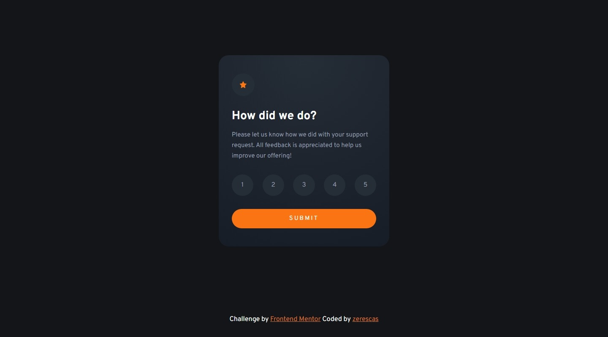
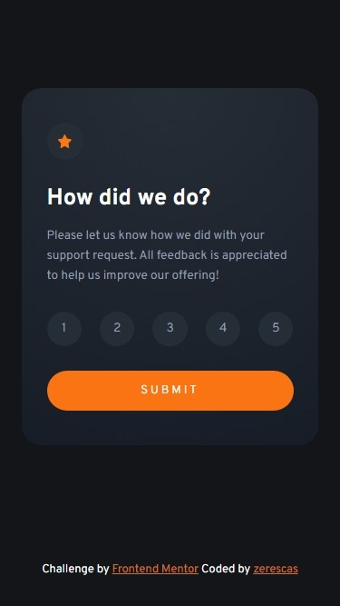
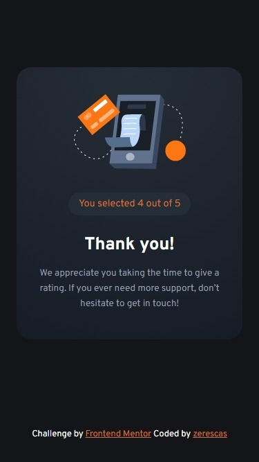

# Frontend Mentor - Interactive rating component solution

This is a solution to the [Interactive rating component challenge on Frontend Mentor](https://www.frontendmentor.io/challenges/interactive-rating-component-koxpeBUmI). Frontend Mentor challenges help you improve your coding skills by building realistic projects. 

## Table of contents

- [Overview](#overview)
    - [The challenge](#the-challenge)
    - [Screenshots](#screenshots)
        - [Desktop](#desktop)
        - [Mobile](#mobile)
    - [Links](#links)
- [My process](#my-process)
    - [Build with](#built-with)
    - [What I learned](#what-i-learned)
- [Author](#author)

## Overview

### The challenge

Users should be able to:

- View the optimal layout for the app depending on their device's screen size
- See hover states for all interactive elements on the page
- Select and submit a number rating
- See the "Thank you" card state after submitting a rating

### Screenshots

#### Desktop

<br>
<br>

#### Mobile

<br>
<br>

### Links

- Live Site URL: [https://zerescas.github.io/interactive-rating-component/](https://zerescas.github.io/interactive-rating-component/)

## My process

### Built with

- Semantic HTML5 markup
- CSS custom properties and flexbox
- Interaction with DOM
- Javascript with jQuery

### What I learned

<strong>The goal - get all items with a specifical class and add click event (set inner text) to them.</strong> <br> 
The vanilla way interaction with "Document Object Model" looks so wordy. Also I need to iterate manually through items.
```js
// get all items with a class "rating-option"
var ratingOptions = document.querySelectorAll(".rating-option");
// or
ratingOptions = document.getElementsByClassName("rating-option");

// add click event to each item
ratingOptions.forEach((ratingOption) => {
    ratingOption.addEventListener("click", function() {
        this.innerHTML = "Custom Message";
    })
});
```

But there is other way - jQuery. The library which makes life easer.
```js
// get all items with a class "rating-option" AND add click event to them
$(".rating-option").on("click", function() {
    $(this).text("Custom Message");
});
```

There's some interesting jQuery functions
```js

// get css property "width"
$(".example-class").css("padding")

// set css property "width" to 1rem
$(".example-class").css("padding", "1rem")

// Hide element through animate opactiy from 1 to 0
$(".example-class").fadeOut();

// Show element through animate opactiy from 1 to 0
$(".example-class").fadeIn();

// Animate custom css properties
$(".example-class").animate({width: 100%});

// Chain of functions. Next function gets called after the previous function ended
$(".example-class").fadeOut().fadeIn();

// ...

```

## Author

- Twitter - [https://twitter.com/zerescas](https://twitter.com/zerescas)
- Telegram - [https://t.me/zerescas](https://t.me/zerescas)