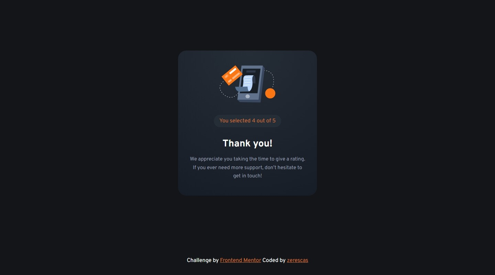

# Frontend Mentor - Interactive rating component solution

This is a solution to the [Interactive rating component challenge on Frontend Mentor](https://www.frontendmentor.io/challenges/interactive-rating-component-koxpeBUmI). Frontend Mentor challenges help you improve your coding skills by building realistic projects. 

## Table of contents

- [Overview](#overview)
    - [The challenge](#the-challenge)
    - [Screenshots](#screenshots)
        - [Desktop](#desktop)
        - [Mobile](#mobile)
    - [Links](#links)
- [My process](#my-process)
    - [Build with](#built-with)
    - [What I learned](#what-i-learned)
- [Author](#author)

## Overview

### The challenge

Users should be able to:

- View the optimal layout for the app depending on their device's screen size
- See hover states for all interactive elements on the page
- Select and submit a number rating
- See the "Thank you" card state after submitting a rating

### Screenshots

#### Desktop

 
 

#### Mobile

 
 

### Links

- Live Site URL: [https://zerescas.github.io/interactive-rating-component/](https://zerescas.github.io/interactive-rating-component/)

## My process

### Built with

- Semantic HTML5 markup
- CSS custom properties and flexbox
- Javascript with jQuery

### What I learned

## Author

- Twitter - [https://twitter.com/zerescas](https://twitter.com/zerescas)
- Telegram - [https://t.me/zerescas](https://t.me/zerescas)